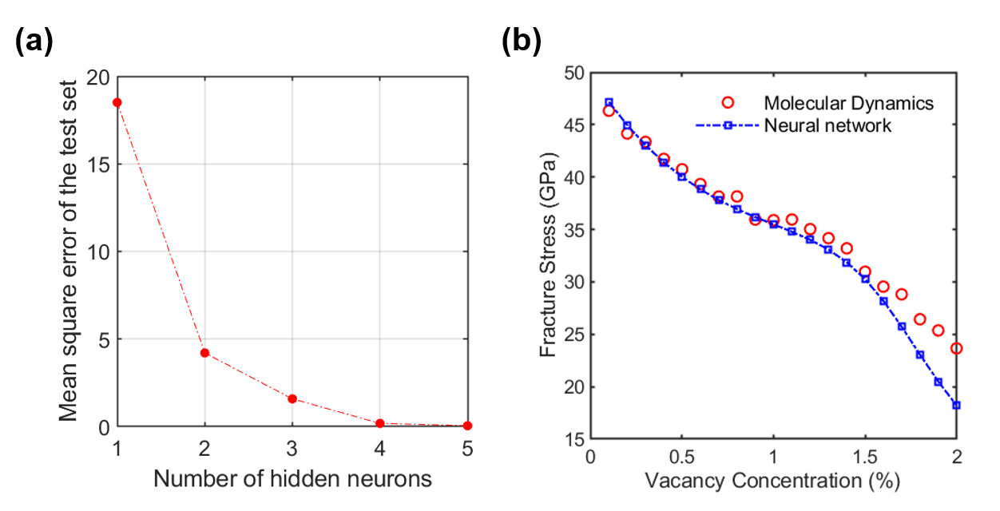

# Neural Networks Tutorials
This repository contains data and MATLAB scripts to reproduce some results in Dewapriya et al. Carbon, vol. 163, 2020, pp. 425-440: [Characterizing fracture stress of defective graphene samples using shallow and deep artificial neural networks.](https://www.sciencedirect.com/science/article/abs/pii/S0008622320302815)

The Matlab code in the folder "how_many_neurons" demonstrates the influence of the number of hidden neurons on the performance of a neural network, which takes in 4 inputs: (1) temperature, (2) vacancy concentration, (3) directional constant, and (4) strain rate. 
The output of the network is the fracture stress of a graphene sample under the 4 input conditions. The code also plot the figure (a).
 
The Matlab code in the folder “predicting_fracture_stress” can be used to compute the fracture stress of graphene samples using a pre-trained neural network and to plot the figure (b), which is a part of Fig. 13 in Dewapriya et al. Carbon, vol. 163, 2020, pp. 425-440.
 
  
